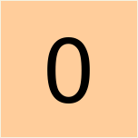
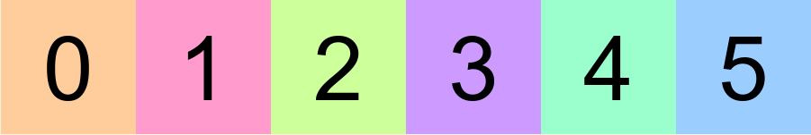
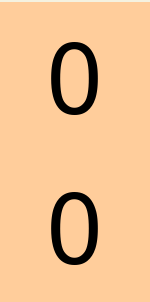
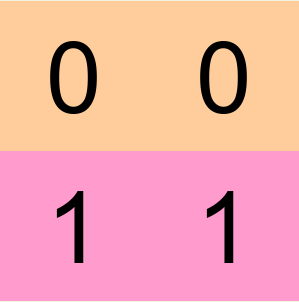
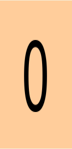
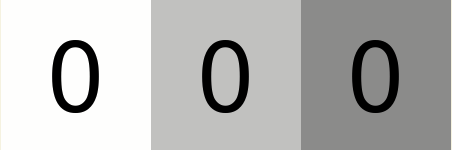
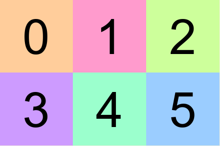
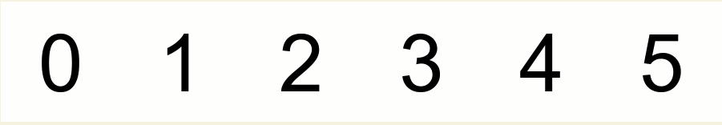
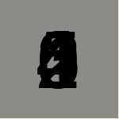
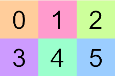

# Einops, Einsum & Tensor Manipulation

::: tip 学习目标
- 了解Einstein求和约定的基础知识.
- 了解如何使用`einops`执行基本的张量重排,以及如何使用`einsum`对张量执行标准线性代数运算.
:::

本节包含大量的练习.请按需浏览完成.

## 阅读材料
- 请在[此处](https://www.blopig.com/blog/2022/05/einops-powerful-library-for-tensor-operations-in-deep-learning/)了解`einops`库的优势.
- 如果你还没看过的话,请先看看[Einops基础教程](https://einops.rocks/1-einops-basics/)(直到"fancy examples部分").
- 阅读[einsum is all you need](https://rockt.github.io/2018/04/30/einsum)(或者看他的[视频](https://www.youtube.com/watch?v=pkVwUVEHmfI))来简要的浏览`einsum`函数及其工作原理(你无需阅读2.10节)

## 预先准备
```python
import os
import sys
import math
import numpy as np
import einops
import torch as t
from pathlib import Path

# Make sure exercises are in the path
chapter = r"chapter0_fundamentals"
exercises_dir = Path(f"{os.getcwd().split(chapter)[0]}/{chapter}/exercises").resolve()
section_dir = exercises_dir / "part0_prereqs"
if str(exercises_dir) not in sys.path: sys.path.append(str(exercises_dir))

from plotly_utils import imshow, line, bar
from part0_prereqs.utils import display_array_as_img
import part0_prereqs.tests as tests

MAIN = __name__ == "__main__"
```

## Einops
```python
arr = np.load(section_dir / "numbers.npy")
```
`arr`是一个4D的numpy数组.第一个轴对应数字,接下来三个轴分别是通道(即RGB),高度和宽度.我们提供了函数`utils.display_array_as_img`,他能接受numpy数组并将其显示为图像.该函数有两种运行方式:
- 如果输入一个3维的数组,三个维度会被按照`(通道, 高度, 宽度)`的方式来理解--换句话说,就是和RGB图片一样.
- 如果输入一个2维的数组,两个维度会被按照`(高度, 宽度)`的方式来理解--即单色图像.
举个例子:
```python
display_array_as_img(arr[0])
```

下面是一系列的图像,这些图像是使用`arr`上执行的`einops`函数创建的.你应该尝试自己展示每张图像,此页面还包含Solution,但是你应该在至少尝试5分钟后再查看他们.
**_这部分内容不是很重要,所以如果你觉得没有必要的话可以直接跳到后面._**

### Einops exercises - images
::: tip TIPS
Difficulty: 🔴🔴⚪⚪⚪

Importance: 🔵🔵🔵⚪⚪

你应该花最多45分钟在这个练习上.

如果你觉得你已经基本理解了有关内容,那么你可以跳到下个小节.
:::

#### Exercise 1

```python
# Your code here - define arr1

display_array_as_img(arr1)
```
::: details SOLUTION
```python
arr1 = einops.rearrange(arr, "b c h w -> c h (b w)")
```
:::

#### Exercise2

```python
# Your code here - define arr2

display_array_as_img(arr2)
```
::: details SOLUTION
```python 
arr2 = einops.repeat(arr[0], "c h w -> c (2 h) w")
```
:::

#### Exercise3

```python
# Your code here - define arr3

display_array_as_img(arr3)
```
::: details SOLUTION
```python 
arr3 = einops.repeat(arr[0:2], "b c h w -> c (b h) (2 w)")
```
:::

#### Exercise4

```python
# Your code here - define arr4

display_array_as_img(arr4)
```
::: details SOLUTION
```python 
arr4 = einops.repeat(arr[0], "c h w -> c (h 2) w")
```
:::

#### Exercise 5

```python
# Your code here - define arr5

display_array_as_img(arr5)
```
::: details SOLUTION
```python 
arr5 = einops.rearrange(arr[0], "c h w -> h (c w)")
```
:::

#### Exercise 6

```python
# Your code here - define arr6

display_array_as_img(arr6)
```
::: details SOLUTION
```python
arr6 = einops.rearrange(arr, "(b1 b2) c h w -> c (b1 h) (b2 w)", b1=2)
```
:::

#### Exercise 7

```python
# Your code here - define arr7

display_array_as_img(arr7)
```
::: details SOLUTION
```python 
arr7 = einops.reduce(arr.astype(float), "b c h w -> h (b w)", "max").astype(int)
```
:::

#### Exercise 8

```python
# Your code here - define arr8

display_array_as_img(arr8)
```
::: details SOLUTION
```python 
arr8 = einops.reduce(arr.astype(float), "b c h w -> h w", "min").astype(int)
```
:::

#### Exercise 9

```python
# Your code here - define arr9

display_array_as_img(arr9)
```
::: details SOLUTION
```python 
arr9 = einops.rearrange(arr[1], "c h w -> c w h")
```
:::

#### Exercise 10

```python
# Your code here - define arr10

display_array_as_img(arr10)
```
::: details SOLUTION
```python 
arr10 = einops.reduce(arr, "(b1 b2) c (h h2) (w w2) -> c (b1 h) (b2 w)", "max", h2=2, w2=2, b1=2)
```
:::

### Einops exercises - operations
接下来,我们有一系列的函数需要你使用`einops`库实现其功能.在所有这些练习下方的Solution中可以查看解答.
首先,我们来定义一些函数来帮助我们测试你的Solution是否正确.
```python
def assert_all_equal(actual: t.Tensor, expected: t.Tensor) -> None:
    assert actual.shape == expected.shape, f"Shape mismatch, got: {actual.shape}"
    assert (actual == expected).all(), f"Value mismatch, got: {actual}"
    print("Passed!")

def assert_all_close(actual: t.Tensor, expected: t.Tensor, rtol=1e-05, atol=0.0001) -> None:
    assert actual.shape == expected.shape, f"Shape mismatch, got: {actual.shape}"
    assert t.allclose(actual, expected, rtol=rtol, atol=atol)
    print("Passed!")
```

#### Exercise A.1 - rearrnage(1)
```python
def rearrange_1() -> t.Tensor:
    '''Return the following tensor using only torch.arange and einops.rearrange:

    [[3, 4],
     [5, 6],
     [7, 8]]
    '''
    pass


expected = t.tensor([[3, 4], [5, 6], [7, 8]])
assert_all_equal(rearrange_1(), expected)
```
::: details SOLUTION
```python
def rearrange_1() -> t.Tensor:
    '''Return the following tensor using only torch.arange and einops.rearrange:

    [[3, 4],
    [5, 6],
    [7, 8]]
    '''
    return einops.rearrange(t.arange(3, 9), "(h w) -> h w", h=3, w=2)
```
:::

#### Exercise A.2 - rearrange(2)
```python
def rearrange_2() -> t.Tensor:
    '''Return the following tensor using only torch.arange and einops.rearrange:

    [[1, 2, 3],
     [4, 5, 6]]
    '''
    pass


assert_all_equal(rearrange_2(), t.tensor([[1, 2, 3], [4, 5, 6]]))
```
::: details SOLUTION
```python
def rearrange_2() -> t.Tensor:
    '''Return the following tensor using only torch.arange and einops.rearrange:

    [[1, 2, 3],
    [4, 5, 6]]
    '''
    return einops.rearrange(t.arange(1, 7), "(h w) -> h w", h=2, w=3)
```
:::

#### Exercise A.3 - rearrnage(3)
```python
def rearrange_3() -> t.Tensor:
    '''Return the following tensor using only torch.arange and einops.rearrange:

    [[[1], [2], [3], [4], [5], [6]]]
    '''
    pass


assert_all_equal(rearrange_3(), t.tensor([[[1], [2], [3], [4], [5], [6]]]))
```
::: details SOLUTION
```python
def rearrange_3() -> t.Tensor:
    '''Return the following tensor using only torch.arange and einops.rearrange:

    [[[1], [2], [3], [4], [5], [6]]]
    '''
    return einops.rearrange(t.arange(1, 7), "a -> 1 a 1")
```
:::

#### Exercise B.1 - temperature average
```python
def temperatures_average(temps: t.Tensor) -> t.Tensor:
    '''Return the average temperature for each week.

    temps: a 1D temperature containing temperatures for each day.
    Length will be a multiple of 7 and the first 7 days are for the first week, second 7 days for the second week, etc.

    You can do this with a single call to reduce.
    '''
    assert len(temps) % 7 == 0
    pass


temps = t.Tensor([71, 72, 70, 75, 71, 72, 70, 68, 65, 60, 68, 60, 55, 59, 75, 80, 85, 80, 78, 72, 83])
expected = t.tensor([71.5714, 62.1429, 79.0])
assert_all_close(temperatures_average(temps), expected)
```
::: details SOLUTION
```python
def temperatures_average(temps: t.Tensor) -> t.Tensor:
    '''Return the average temperature for each week.

    temps: a 1D temperature containing temperatures for each day.
    Length will be a multiple of 7 and the first 7 days are for the first week, second 7 days for the second week, etc.

    You can do this with a single call to reduce.
    '''
    assert len(temps) % 7 == 0
    return einops.reduce(temps, "(h 7) -> h", "mean")
```
:::

#### Exercise B.2 - temperature difference
```python
def temperatures_differences(temps: t.Tensor) -> t.Tensor:
    '''For each day, subtract the average for the week the day belongs to.

    temps: as above
    '''
    assert len(temps) % 7 == 0
    pass


expected = t.tensor(
    [
        -0.5714,
        0.4286,
        -1.5714,
        3.4286,
        -0.5714,
        0.4286,
        -1.5714,
        5.8571,
        2.8571,
        -2.1429,
        5.8571,
        -2.1429,
        -7.1429,
        -3.1429,
        -4.0,
        1.0,
        6.0,
        1.0,
        -1.0,
        -7.0,
        4.0,
    ]
)
actual = temperatures_differences(temps)
assert_all_close(actual, expected)
```
::: details SOLUTION
```python
def temperatures_differences(temps: t.Tensor) -> t.Tensor:
    '''For each day, subtract the average for the week the day belongs to.

    temps: as above
    '''
    assert len(temps) % 7 == 0
    avg = einops.repeat(temperatures_average(temps), "w -> (w 7)")
    return temps - avg
```
:::

#### Exercise B.3 - temperature normalized
```python
def temperatures_normalized(temps: t.Tensor) -> t.Tensor:
    '''For each day, subtract the weekly average and divide by the weekly standard deviation.

    temps: as above

    Pass torch.std to reduce.
    '''
    pass


expected = t.tensor(
    [
        -0.3326,
        0.2494,
        -0.9146,
        1.9954,
        -0.3326,
        0.2494,
        -0.9146,
        1.1839,
        0.5775,
        -0.4331,
        1.1839,
        -0.4331,
        -1.4438,
        -0.6353,
        -0.8944,
        0.2236,
        1.3416,
        0.2236,
        -0.2236,
        -1.5652,
        0.8944,
    ]
)
actual = temperatures_normalized(temps)
assert_all_close(actual, expected)
```
::: details SOLUTION
```python
def temperatures_normalized(temps: t.Tensor) -> t.Tensor:
    '''For each day, subtract the weekly average and divide by the weekly standard deviation.

    temps: as above

    Pass torch.std to reduce.
    '''
    avg = einops.repeat(temperatures_average(temps), "w -> (w 7)")
    std = einops.repeat(einops.reduce(temps, "(h 7) -> h", t.std), "w -> (w 7)")
    return (temps - avg) / std
```
:::

#### Exercise C - identity matrix
```python
def identity_matrix(n: int) -> t.Tensor:
    '''Return the identity matrix of size nxn.

    Don't use torch.eye or similar.

    Hint: you can do it with arange, rearrange, and ==.
    Bonus: find a different way to do it.
    '''
    assert n >= 0
    pass


assert_all_equal(identity_matrix(3), t.Tensor([[1, 0, 0], [0, 1, 0], [0, 0, 1]]))
assert_all_equal(identity_matrix(0), t.zeros((0, 0)))
```
::: details SOLUTION
```python
def identity_matrix(n: int) -> t.Tensor:
    '''Return the identity matrix of size nxn.

    Don't use torch.eye or similar.

    Hint: you can do it with arange, rearrange, and ==.
    Bonus: find a different way to do it.
    '''
    assert n >= 0
    return (einops.rearrange(t.arange(n), "i->i 1") == t.arange(n)).float()
```
:::

#### Exercise D - sample distribution
```python
def sample_distribution(probs: t.Tensor, n: int) -> t.Tensor:
    '''Return n random samples from probs, where probs is a normalized probability distribution.

    probs: shape (k,) where probs[i] is the probability of event i occurring.
    n: number of random samples

    Return: shape (n,) where out[i] is an integer indicating which event was sampled.

    Use torch.rand and torch.cumsum to do this without any explicit loops.

    Note: if you think your solution is correct but the test is failing, try increasing the value of n.
    '''
    assert abs(probs.sum() - 1.0) < 0.001
    assert (probs >= 0).all()
    pass


n = 10000000
probs = t.tensor([0.05, 0.1, 0.1, 0.2, 0.15, 0.4])
freqs = t.bincount(sample_distribution(probs, n)) / n
assert_all_close(freqs, probs, rtol=0.001, atol=0.001)
```
::: details SOLUTION
```python
def sample_distribution(probs: t.Tensor, n: int) -> t.Tensor:
    '''Return n random samples from probs, where probs is a normalized probability distribution.

    probs: shape (k,) where probs[i] is the probability of event i occurring.
    n: number of random samples

    Return: shape (n,) where out[i] is an integer indicating which event was sampled.

    Use torch.rand and torch.cumsum to do this without any explicit loops.

    Note: if you think your solution is correct but the test is failing, try increasing the value of n.
    '''
    assert abs(probs.sum() - 1.0) < 0.001
    assert (probs >= 0).all()
    return (t.rand(n, 1) > t.cumsum(probs, dim=0)).sum(dim=-1)
```
:::

#### Exercise E - classifier accuracy
```python
def classifier_accuracy(scores: t.Tensor, true_classes: t.Tensor) -> t.Tensor:
    '''Return the fraction of inputs for which the maximum score corresponds to the true class for that input.

    scores: shape (batch, n_classes). A higher score[b, i] means that the classifier thinks class i is more likely.
    true_classes: shape (batch, ). true_classes[b] is an integer from [0...n_classes).

    Use torch.argmax.
    '''
    assert true_classes.max() < scores.shape[1]
    pass


scores = t.tensor([[0.75, 0.5, 0.25], [0.1, 0.5, 0.4], [0.1, 0.7, 0.2]])
true_classes = t.tensor([0, 1, 0])
expected = 2.0 / 3.0
assert classifier_accuracy(scores, true_classes) == expected
```
::: details SOLUTION
```python
def classifier_accuracy(scores: t.Tensor, true_classes: t.Tensor) -> t.Tensor:
    '''Return the fraction of inputs for which the maximum score corresponds to the true class for that input.

    scores: shape (batch, n_classes). A higher score[b, i] means that the classifier thinks class i is more likely.
    true_classes: shape (batch, ). true_classes[b] is an integer from [0...n_classes).

    Use torch.argmax.
    '''
    assert true_classes.max() < scores.shape[1]
    return (scores.argmax(dim=1) == true_classes).float().mean()
```
:::

#### Exercise F.1 - total price indexing
```python
def total_price_indexing(prices: t.Tensor, items: t.Tensor) -> float:
    '''Given prices for each kind of item and a tensor of items purchased, return the total price.

    prices: shape (k, ). prices[i] is the price of the ith item.
    items: shape (n, ). A 1D tensor where each value is an item index from [0..k).

    Use integer array indexing. The below document describes this for NumPy but it's the same in PyTorch:

    https://numpy.org/doc/stable/user/basics.indexing.html#integer-array-indexing
    '''
    assert items.max() < prices.shape[0]
    pass


prices = t.tensor([0.5, 1, 1.5, 2, 2.5])
items = t.tensor([0, 0, 1, 1, 4, 3, 2])
assert total_price_indexing(prices, items) == 9.0
```
::: details SOLUTION
```python
def total_price_indexing(prices: t.Tensor, items: t.Tensor) -> float:
    '''Given prices for each kind of item and a tensor of items purchased, return the total price.

    prices: shape (k, ). prices[i] is the price of the ith item.
    items: shape (n, ). A 1D tensor where each value is an item index from [0..k).

    Use integer array indexing. The below document describes this for NumPy but it's the same in PyTorch:

    https://numpy.org/doc/stable/user/basics.indexing.html#integer-array-indexing
    '''
    assert items.max() < prices.shape[0]
    return prices[items].sum().item()
```
:::

#### Exercise F.2 - gather 2D
```python
def gather_2d(matrix: t.Tensor, indexes: t.Tensor) -> t.Tensor:
    '''Perform a gather operation along the second dimension.

    matrix: shape (m, n)
    indexes: shape (m, k)

    Return: shape (m, k). out[i][j] = matrix[i][indexes[i][j]]

    For this problem, the test already passes and it's your job to write at least three asserts relating the arguments and the output. This is a tricky function and worth spending some time to wrap your head around its behavior.

    See: https://pytorch.org/docs/stable/generated/torch.gather.html?highlight=gather#torch.gather
    '''
    "TODO: YOUR CODE HERE"
    out = matrix.gather(1, indexes)
    "TODO: YOUR CODE HERE"
    return out


matrix = t.arange(15).view(3, 5)
indexes = t.tensor([[4], [3], [2]])
expected = t.tensor([[4], [8], [12]])
assert_all_equal(gather_2d(matrix, indexes), expected)
indexes2 = t.tensor([[2, 4], [1, 3], [0, 2]])
expected2 = t.tensor([[2, 4], [6, 8], [10, 12]])
assert_all_equal(gather_2d(matrix, indexes2), expected2)
```
::: details SOLUTION
```python
def gather_2d(matrix: t.Tensor, indexes: t.Tensor) -> t.Tensor:
    '''Perform a gather operation along the second dimension.

    matrix: shape (m, n)
    indexes: shape (m, k)

    Return: shape (m, k). out[i][j] = matrix[i][indexes[i][j]]

    For this problem, the test already passes and it's your job to write at least three asserts relating the arguments and the output. This is a tricky function and worth spending some time to wrap your head around its behavior.

    See: https://pytorch.org/docs/stable/generated/torch.gather.html?highlight=gather#torch.gather
    '''
    assert matrix.ndim == indexes.ndim
    assert indexes.shape[0] <= matrix.shape[0]
    out = matrix.gather(1, indexes)
    assert out.shape == indexes.shape
    return out
```
:::

#### Exercise F.3 - total price gather
```python
def total_price_gather(prices: t.Tensor, items: t.Tensor) -> float:
    '''Compute the same as total_price_indexing, but use torch.gather.'''
    assert items.max() < prices.shape[0]
    pass


prices = t.tensor([0.5, 1, 1.5, 2, 2.5])
items = t.tensor([0, 0, 1, 1, 4, 3, 2])
assert total_price_gather(prices, items) == 9.0
```
::: details SOLUTION
```python
def total_price_gather(prices: t.Tensor, items: t.Tensor) -> float:
    '''Compute the same as total_price_indexing, but use torch.gather.'''
    assert items.max() < prices.shape[0]
    return prices.gather(0, items).sum().item()
```
:::

#### Exercise G - indexing
```python
def integer_array_indexing(matrix: t.Tensor, coords: t.Tensor) -> t.Tensor:
    '''Return the values at each coordinate using integer array indexing.

    For details on integer array indexing, see:
    https://numpy.org/doc/stable/user/basics.indexing.html#integer-array-indexing

    matrix: shape (d_0, d_1, ..., d_n)
    coords: shape (batch, n)

    Return: (batch, )
    '''
    pass


mat_2d = t.arange(15).view(3, 5)
coords_2d = t.tensor([[0, 1], [0, 4], [1, 4]])
actual = integer_array_indexing(mat_2d, coords_2d)
assert_all_equal(actual, t.tensor([1, 4, 9]))
mat_3d = t.arange(2 * 3 * 4).view((2, 3, 4))
coords_3d = t.tensor([[0, 0, 0], [0, 1, 1], [0, 2, 2], [1, 0, 3], [1, 2, 0]])
actual = integer_array_indexing(mat_3d, coords_3d)
assert_all_equal(actual, t.tensor([0, 5, 10, 15, 20]))
```
::: details SOLUTION
```python
def integer_array_indexing(matrix: t.Tensor, coords: t.Tensor) -> t.Tensor:
    '''Return the values at each coordinate using integer array indexing.

    For details on integer array indexing, see:
    https://numpy.org/doc/stable/user/basics.indexing.html#integer-array-indexing

    matrix: shape (d_0, d_1, ..., d_n)
    coords: shape (batch, n)

    Return: (batch, )
    '''
    return matrix[tuple(coords.T)]
```
:::

#### Exercise H.1 - batched logsumexp
```python
def batched_logsumexp(matrix: t.Tensor) -> t.Tensor:
    '''For each row of the matrix, compute log(sum(exp(row))) in a numerically stable way.

    matrix: shape (batch, n)

    Return: (batch, ). For each i, out[i] = log(sum(exp(matrix[i]))).

    Do this without using PyTorch's logsumexp function.

    A couple useful blogs about this function:
    - https://leimao.github.io/blog/LogSumExp/
    - https://gregorygundersen.com/blog/2020/02/09/log-sum-exp/
    '''
    pass


matrix = t.tensor([[-1000, -1000, -1000, -1000], [1000, 1000, 1000, 1000]])
expected = t.tensor([-1000 + math.log(4), 1000 + math.log(4)])
actual = batched_logsumexp(matrix)
assert_all_close(actual, expected)
matrix2 = t.randn((10, 20))
expected2 = t.logsumexp(matrix2, dim=-1)
actual2 = batched_logsumexp(matrix2)
assert_all_close(actual2, expected2)
```
::: details SOLUTION
```python
def batched_logsumexp(matrix: t.Tensor) -> t.Tensor:
    '''For each row of the matrix, compute log(sum(exp(row))) in a numerically stable way.

    matrix: shape (batch, n)

    Return: (batch, ). For each i, out[i] = log(sum(exp(matrix[i]))).

    Do this without using PyTorch's logsumexp function.

    A couple useful blogs about this function:
    - https://leimao.github.io/blog/LogSumExp/
    - https://gregorygundersen.com/blog/2020/02/09/log-sum-exp/
    '''
    C = matrix.max(dim=-1).values
    exps = t.exp(matrix - einops.rearrange(C, "n -> n 1"))
    return C + t.log(t.sum(exps, dim=-1))
```
:::

#### Exercise H.2 - batched softmax
```python
def batched_softmax(matrix: t.Tensor) -> t.Tensor:
    '''For each row of the matrix, compute softmax(row).

    Do this without using PyTorch's softmax function.
    Instead, use the definition of softmax: https://en.wikipedia.org/wiki/Softmax_function

    matrix: shape (batch, n)

    Return: (batch, n). For each i, out[i] should sum to 1.
    '''
    pass


matrix = t.arange(1, 6).view((1, 5)).float().log()
expected = t.arange(1, 6).view((1, 5)) / 15.0
actual = batched_softmax(matrix)
assert_all_close(actual, expected)
for i in [0.12, 3.4, -5, 6.7]:
    assert_all_close(actual, batched_softmax(matrix + i))
matrix2 = t.rand((10, 20))
actual2 = batched_softmax(matrix2)
assert actual2.min() >= 0.0
assert actual2.max() <= 1.0
assert_all_equal(actual2.argsort(), matrix2.argsort())
assert_all_close(actual2.sum(dim=-1), t.ones(matrix2.shape[:-1]))
```
::: details SOLUTION
```python
def batched_softmax(matrix: t.Tensor) -> t.Tensor:
    '''For each row of the matrix, compute softmax(row).

    Do this without using PyTorch's softmax function.
    Instead, use the definition of softmax: https://en.wikipedia.org/wiki/Softmax_function

    matrix: shape (batch, n)

    Return: (batch, n). For each i, out[i] should sum to 1.
    '''
    exp = matrix.exp()
    return exp / exp.sum(dim=-1, keepdim=True)
```
:::

#### Exercise H.3 - batched logsoftmax
```python
def batched_logsoftmax(matrix: t.Tensor) -> t.Tensor:
    '''Compute log(softmax(row)) for each row of the matrix.

    matrix: shape (batch, n)

    Return: (batch, n). For each i, out[i] should sum to 1.

    Do this without using PyTorch's logsoftmax function.
    For each row, subtract the maximum first to avoid overflow if the row contains large values.
    '''
    pass


matrix = t.arange(1, 6).view((1, 5)).float()
start = 1000
matrix2 = t.arange(start + 1, start + 6).view((1, 5)).float()
actual = batched_logsoftmax(matrix2)
expected = t.tensor([[-4.4519, -3.4519, -2.4519, -1.4519, -0.4519]])
assert_all_close(actual, expected)
```
::: details SOLUTION
```python
def batched_logsoftmax(matrix: t.Tensor) -> t.Tensor:
    '''Compute log(softmax(row)) for each row of the matrix.

    matrix: shape (batch, n)

    Return: (batch, n). For each i, out[i] should sum to 1.

    Do this without using PyTorch's logsoftmax function.
    For each row, subtract the maximum first to avoid overflow if the row contains large values.
    '''
    C = matrix.max(dim=1, keepdim=True).values
    return matrix - C - (matrix - C).exp().sum(dim=1, keepdim=True).log()
```
:::

#### Exercise H.4 - batched cross entroy loss
```python
def batched_cross_entropy_loss(logits: t.Tensor, true_labels: t.Tensor) -> t.Tensor:
    '''Compute the cross entropy loss for each example in the batch.

    logits: shape (batch, classes). logits[i][j] is the unnormalized prediction for example i and class j.
    true_labels: shape (batch, ). true_labels[i] is an integer index representing the true class for example i.

    Return: shape (batch, ). out[i] is the loss for example i.

    Hint: convert the logits to log-probabilities using your batched_logsoftmax from above.
    Then the loss for an example is just the negative of the log-probability that the model assigned to the true class. Use torch.gather to perform the indexing.
    '''
    pass


logits = t.tensor([[float("-inf"), float("-inf"), 0], [1 / 3, 1 / 3, 1 / 3], [float("-inf"), 0, 0]])
true_labels = t.tensor([2, 0, 0])
expected = t.tensor([0.0, math.log(3), float("inf")])
actual = batched_cross_entropy_loss(logits, true_labels)
assert_all_close(actual, expected)
```
::: details SOLUTION
```python
def batched_cross_entropy_loss(logits: t.Tensor, true_labels: t.Tensor) -> t.Tensor:
    '''Compute the cross entropy loss for each example in the batch.

    logits: shape (batch, classes). logits[i][j] is the unnormalized prediction for example i and class j.
    true_labels: shape (batch, ). true_labels[i] is an integer index representing the true class for example i.

    Return: shape (batch, ). out[i] is the loss for example i.

    Hint: convert the logits to log-probabilities using your batched_logsoftmax from above.
    Then the loss for an example is just the negative of the log-probability that the model assigned to the true class. Use torch.gather to perform the indexing.
    '''
    assert logits.shape[0] == true_labels.shape[0]
    assert true_labels.max() < logits.shape[1]

    logprobs = batched_logsoftmax(logits)
    indices = einops.rearrange(true_labels, "n -> n 1")
    pred_at_index = logprobs.gather(1, indices)
    return -einops.rearrange(pred_at_index, "n 1 -> n")
```
:::

#### Exercise I.1 - collect rows
```python
def collect_rows(matrix: t.Tensor, row_indexes: t.Tensor) -> t.Tensor:
    '''Return a 2D matrix whose rows are taken from the input matrix in order according to row_indexes.

    matrix: shape (m, n)
    row_indexes: shape (k,). Each value is an integer in [0..m).

    Return: shape (k, n). out[i] is matrix[row_indexes[i]].
    '''
    assert row_indexes.max() < matrix.shape[0]
    pass


matrix = t.arange(15).view((5, 3))
row_indexes = t.tensor([0, 2, 1, 0])
actual = collect_rows(matrix, row_indexes)
expected = t.tensor([[0, 1, 2], [6, 7, 8], [3, 4, 5], [0, 1, 2]])
assert_all_equal(actual, expected)
```
::: details SOLUTION
```python
    def collect_rows(matrix: t.Tensor, row_indexes: t.Tensor) -> t.Tensor:
        '''Return a 2D matrix whose rows are taken from the input matrix in order according to row_indexes.

        matrix: shape (m, n)
        row_indexes: shape (k,). Each value is an integer in [0..m).

        Return: shape (k, n). out[i] is matrix[row_indexes[i]].
        '''
        assert row_indexes.max() < matrix.shape[0]
        return matrix[row_indexes]
```
:::

#### Exercise I.2 - collect columns
```python
def collect_columns(matrix: t.Tensor, column_indexes: t.Tensor) -> t.Tensor:
    '''Return a 2D matrix whose columns are taken from the input matrix in order according to column_indexes.

    matrix: shape (m, n)
    column_indexes: shape (k,). Each value is an integer in [0..n).

    Return: shape (m, k). out[:, i] is matrix[:, column_indexes[i]].
    '''
    assert column_indexes.max() < matrix.shape[1]
    pass


matrix = t.arange(15).view((5, 3))
column_indexes = t.tensor([0, 2, 1, 0])
actual = collect_columns(matrix, column_indexes)
expected = t.tensor([[0, 2, 1, 0], [3, 5, 4, 3], [6, 8, 7, 6], [9, 11, 10, 9], [12, 14, 13, 12]])
assert_all_equal(actual, expected)
```
::: details SOLUTION
```python
def collect_columns(matrix: t.Tensor, column_indexes: t.Tensor) -> t.Tensor:
    '''Return a 2D matrix whose columns are taken from the input matrix in order according to column_indexes.

    matrix: shape (m, n)
    column_indexes: shape (k,). Each value is an integer in [0..n).

    Return: shape (m, k). out[:, i] is matrix[:, column_indexes[i]].
    '''
    assert column_indexes.max() < matrix.shape[1]
    return matrix[:, column_indexes]
```
:::

---
### Einsum
Einsum是一个在执行线性代数操作时非常有用的函数,你可能会经常用到它.

::: tip TIPS
注意,我们使用的是该函数的`einops.einsum`版本,他的使用方式和传统的`torch.einsum`有些许不同:

- `einops.einsum`将数组作为第一个参数,并使用空格来区分维度
- `torch.einsum`将字符串作为第一个参数,并且不使用空格来区分维度(每个维度使用单个字母表示).

举个例子,`torch.einsum("ij,i->j", A, b)`和`einops.einsum(A, b, "i j, i -> j")`是等价的.(注意einops并不关心在`,`和`->`前后是否有空格,所以你不需要完全按照这个格式来写)
:::

尽管有许多不同的操作,但是这些操作都是基于三个关键规则:

1. 在不同的输入中使用重复字母意味着这些值将相乘,并且他们的乘积将出现在输出中.
    - 例如`M = einops.einsum(A, B, "i j, i j -> i j")`对应`A`和`B`两矩阵按位乘积`M = A * B`.
2. 省略字母意味着这个字母代表的轴将被求和.
    - 例如,如果`x`是一个2维的数组,形状为`(I, J)`,那么`einops.einsum(x, "i j -> i")`将是一个长度为`I`的1维数组,每个值为`x`按行求和的值(即沿着`j`轴求和,即按行求和).
3. 我们可以以任何顺序返回未求和的轴.
    - 例如,`einops.einsum(x, "i j k -> k j i")`和`einops.rearrange(x, "i j k -> k j i")`效果一样.


_注意,einops的作者有计划要支持形状重排,例如这样的操作`einops.einsum(x, y, "i j, j k l -> i (k l)")`(即同时结合了rearrange和einsum的特点).所以我们可以期待那一天的到来._

#### Einsum exercises
::: tip TIPS
Difficulty: 🔴🔴⚪⚪⚪

Importance: 🔵🔵🔵🔵⚪

你应该花最多15-20分钟在这个练习上.

如果你觉得你已经基本理解了有关内容,那么你可以跳到下个小节.
:::

在以下练习中,你将使用`einsum`编写简单的函数,这些函数复现了Numpy里的一些标准函数实现的功能: 迹, 矩阵乘法, 内积和外积.我们还提供了一些测试函数来检验你的结果.

注意,当前版本的einsum要求你的字符串中必须有`->`,即使你的矩阵求和到只有一个标量(即`->`右边是空的).
```python
def einsum_trace(mat: np.ndarray):
    '''
    Returns the same as `np.trace`.
    '''
    pass

def einsum_mv(mat: np.ndarray, vec: np.ndarray):
    '''
    Returns the same as `np.matmul`, when `mat` is a 2D array and `vec` is 1D.
    '''
    pass

def einsum_mm(mat1: np.ndarray, mat2: np.ndarray):
    '''
    Returns the same as `np.matmul`, when `mat1` and `mat2` are both 2D arrays.
    '''
    pass

def einsum_inner(vec1: np.ndarray, vec2: np.ndarray):
    '''
    Returns the same as `np.inner`.
    '''
    pass

def einsum_outer(vec1: np.ndarray, vec2: np.ndarray):
    '''
    Returns the same as `np.outer`.
    '''
    pass


tests.test_einsum_trace(einsum_trace)
tests.test_einsum_mv(einsum_mv)
tests.test_einsum_mm(einsum_mm)
tests.test_einsum_inner(einsum_inner)
tests.test_einsum_outer(einsum_outer)
```
::: details SOLUTION
```python
    def einsum_trace(mat: np.ndarray):
        '''
        Returns the same as `np.trace`.
        '''
        # SOLUTION
        return einops.einsum(mat, "i i ->")

    def einsum_mv(mat: np.ndarray, vec: np.ndarray):
        '''
        Returns the same as `np.matmul`, when `mat` is a 2D array and `vec` is 1D.
        '''
        # SOLUTION
        return einops.einsum(mat, vec, "i j, j -> i")

    def einsum_mm(mat1: np.ndarray, mat2: np.ndarray):
        '''
        Returns the same as `np.matmul`, when `mat1` and `mat2` are both 2D arrays.
        '''
        # SOLUTION
        return einops.einsum(mat1, mat2, "i j, j k -> i k")

    def einsum_inner(vec1: np.ndarray, vec2: np.ndarray):
        '''
        Returns the same as `np.inner`.
        '''
        # SOLUTION
        return einops.einsum(vec1, vec2, "i, i ->")

    def einsum_outer(vec1: np.ndarray, vec2: np.ndarray):
        '''
        Returns the same as `np.outer`.
        '''
        # SOLUTION
        return einops.einsum(vec1, vec2, "i, j -> i j")
```
:::
