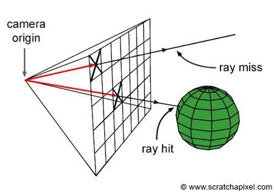

# 射线和线段(Rays & Segments)
## 一维图像渲染
在我们的初始假定中,**相机**是原点处的单个点,**屏幕**是x=1处的平面.

这个世界中的**物体**由三角形组成,其中三角形在三维空间中表示为3个点(因此每个三角形由9个浮点值决定).你可以用足够多的三角形构建任何形状,你的皮卡丘将由412个三角形组成.

相机将发射一条或多条**光线(射线)**,每条射线由原点和方向点表示.从概念上讲,光线将从原点发射并沿着给定方向传播,直到与物体相交.

我们现在还没有建立亮度或者颜色的概念,所以现在我们认为,如果从原点穿过屏幕的光线与物体相交,屏幕上的像素应该显示亮的颜色,否则我们的屏幕应该是黑的.

在最开始,在我们的`(x, y, z)`空间里,我们的z轴设为0,所有的任务都在剩下两个维度里进行.

### Exercise - 完成 `make_rays_1d`
<div style="background-color: #FFDDDD; padding: 10px; border-radius: 5px; margin-bottom: 10px">
<span class="token token key atrule">Difficulty: 🔴🔴⚪⚪⚪</span><br>
<span class="token token key atrule">Importance: 🔵🔵🔵⚪⚪</span><br>
你应该花最多10-15分钟在这个练习上.<br>
</div>

填充完成`make_rays_1d`函数,使得其可以从原点`(0, 0, 0)`生成一系列射线.

在你的光线上调用`render_linear_with_plotly`可以把他们展示在3D图中.
```python
def make_rays_1d(num_pixels: int, y_limit: float) -> t.Tensor:
    '''
    num_pixels: The number of pixels in the y dimension. Since there is one ray per pixel, this is also the number of rays.
    y_limit: At x=1, the rays should extend from -y_limit to +y_limit, inclusive of both endpoints.

    Returns: shape (num_pixels, num_points=2, num_dim=3) where the num_points dimension contains (origin, direction) and the num_dim dimension contains xyz.

    Example of make_rays_1d(9, 1.0): [
        [[0, 0, 0], [1, -1.0, 0]],
        [[0, 0, 0], [1, -0.75, 0]],
        [[0, 0, 0], [1, -0.5, 0]],
        ...
        [[0, 0, 0], [1, 0.75, 0]],
        [[0, 0, 0], [1, 1, 0]],
    ]
    '''
    pass

rays1d = make_rays_1d(9, 10.0)

fig = render_lines_with_plotly(rays1d)
```
<div style="background-color: #FFDDDD; padding: 10px; border-radius: 5px; margin-bottom: 10px">
<details>
    <summary style="margin-bottom: 3px">Solution</summary>
    <div style="background-color: #FFFFFF; border: 4px solid #9999FF;">

    def make_rays_1d(num_pixels: int, y_limit: float) -> t.Tensor:
        '''
        num_pixels: The number of pixels in the y dimension. Since there is one ray per pixel, this is also the number of rays.
        y_limit: At x=1, the rays should extend from -y_limit to +y_limit, inclusive of both endpoints.

        Returns: shape (num_pixels, num_points=2, num_dim=3) where the num_points dimension contains (origin, direction) and the num_dim dimension contains xyz.

        Example of make_rays_1d(9, 1.0): [
            [[0, 0, 0], [1, -1.0, 0]],
            [[0, 0, 0], [1, -0.75, 0]],
            [[0, 0, 0], [1, -0.5, 0]],
            ...
            [[0, 0, 0], [1, 0.75, 0]],
            [[0, 0, 0], [1, 1, 0]],
        ]
        '''
        # SOLUTION
        rays = t.zeros((num_pixels, 2, 3), dtype=t.float32)
        t.linspace(-y_limit, y_limit, num_pixels, out=rays[:, 1, 1])
        rays[:, 1, 0] = 1
        return rays


    rays1d = make_rays_1d(9, 10.0)

</div>
</details>
</div>

### Tip - `out`参数
许多PyTorch函数都有一个可选的参数`out`.如果提供的话,输出的张量将直接输出到`out`张量上,而不是分配一个新张量并返回它.

如果你在完成上面的函数的时候使用了`torch.arange`或者`torch.linspace`,试试用用`out`参数.注意基本的切片索引方式例如`rays[:, 1, 1]`返回了一个视图(view),其在内存中占用的位置和`rays`一致,所以如果修改了这个视图的内容也会修改原始`rays`的内容.在今天晚些时候你会学到更多关于视图的内容.

## 射线-物体交点
假设我们有一个由端点$L_1$和$L_2$定义的线段.那么对于一条给定的射线,我们可以通过以下方法检测这条射线是否和线段交叉:
- 假设射线和线段都是无限长的,解出他们的交点.
- 如果这个交点存在,检查这个交点是否同时在射线和线段上.

我们的相机射线由原点$O$和方向向量$D$定义,我们的物体线段由端点$L_1$和$L_2$定义.

我们可以将相机射线上所有点的方程写为$R(u)=O+uD$,其中$u\in[0,\infin)$;物体线段上所有点的方程写为$O(v)=L_1 + v(L_2-L_1)$,其中$v\in[0,1]$.

下面的交互式小程序可以让你在处理问题的时候参数化.运行以下单元格:
```python
fig = setup_widget_fig_ray()
display(fig)

@interact
def response(seed=(0, 10, 1), v=(-2.0, 2.0, 0.01)):
    t.manual_seed(seed)
    L_1, L_2 = t.rand(2, 2)
    P = lambda v: L_1 + v * (L_2 - L_1)
    x, y = zip(P(-2), P(2))
    with fig.batch_update(): 
        fig.data[0].update({"x": x, "y": y}) 
        fig.data[1].update({"x": [L_1[0], L_2[0]], "y": [L_1[1], L_2[1]]}) 
        fig.data[2].update({"x": [P(v)[0]], "y": [P(v)[1]]})
```
联立解出上面的射线和线段表达式:
$$
O+uD=L_1+v(L_2-L_1)\\
uD-v(L_2-L_1)=L_1-O\\
\begin{pmatrix}D_x & (L_1-L_2)_x \\ D_y & (L_1-L_2)_y\end{pmatrix}\begin{pmatrix}u\\v\end{pmatrix}=\begin{pmatrix}(L_1-O)_x\\(L_1-O)_y\end{pmatrix}
$$
一旦找到了$u$和$v$的值满足方程(如果平行就无解),我们只需要检查$u\ge0$和$v\in[0,1]$是否同时满足即可.

### Exercise - 哪些线段和射线相交?
<div style="background-color: #FFDDDD; padding: 10px; border-radius: 5px; margin-bottom: 10px">
<span class="token token key atrule">Difficulty: 🔴🔴🔴⚪⚪</span><br>
<span class="token token key atrule">Importance: 🔵⚪⚪⚪⚪</span><br>
你应该花最多10-15分钟在这个练习上.<br>
</div>

对以下每一条线段,他们分别与先前的相机射线(指上个练习生成的9条射线)的哪些相交?
```python
segments = t.tensor([
    [[1.0, -12.0, 0.0], [1, -6.0, 0.0]], 
    [[0.5, 0.1, 0.0], [0.5, 1.15, 0.0]], 
    [[2, 12.0, 0.0], [2, 21.0, 0.0]]
])
```
<div style="background-color: #FFDDDD; padding: 10px; border-radius: 5px; margin-bottom: 10px">
<details>
    <summary style="margin-bottom: 3px">Solution - 相交的射线</summary>
    运行以下代码来可视化射线和线段:
    <div style="background-color: #FFFFFF; border: 4px solid #9999FF;">
    
    render_lines_with_plotly(rays1d, segments)

</div>
    <li>线段0和前两条射线相交.</li>
    <li>线段1不与任何射线相交.</li>
    <li>线段2与最后两条射线相交.计算<code>rays * 2</code>来将射线投影到<code>x=1.5</code>的地方.请记住虽然可视化中将射线显示为线段,但射线在概念上是无限延伸的.</li>
</details>
</div>

### Exercise - 完成`intersect_ray_1d`
<div style="background-color: #FFDDDD; padding: 10px; border-radius: 5px; margin-bottom: 10px">
<span class="token token key atrule">Difficulty: 🔴🔴🔴⚪⚪</span><br>
<span class="token token key atrule">Importance: 🔵🔵🔵🔵⚪</span><br>
你应该花最多20-25分钟在这个练习上.<br>
<span class="token token key atrule">这里包括了今天的核心概念:</span>张量操作,线性运算等
</div>

使用[`torch.lingalg.solve`](https://pytorch.org/docs/stable/generated/torch.linalg.solve.html)和[`torch.stack`](https://pytorch.org/docs/stable/generated/torch.stack.html)完成`intersect_ray_1d`函数来解出上面的矩阵方程.
<div style="background-color: #FFDDDD; padding: 10px; border-radius: 5px; margin-bottom: 10px">
<details>
    <summary style="margin-bottom: 3px">Aside - stack和concatenate的区别</summary>
    <code>torch.stack</code>将沿着一个新维度组合两个张量.
    <div style="background-color: #FFFFFF; border: 4px solid #9999FF;">
    
    >>> t.stack([t.ones(2, 2), t.zeros(2, 2)], dim=0)
    tensor([[[1., 1.],
            [1., 1.]],

            [[0., 0.],
            [0., 0.]]])

</div>
    <code>torch.concat</code>(别名<code>torch.cat</code>)将沿着一个已存在的维度组合两个张量.
    <div style="background-color: #FFFFFF; border: 4px solid #9999FF;">
    
    >>> t.cat([t.ones(2, 2), t.zeros(2, 2)], dim=0)
    tensor([[1., 1.], 
            [1., 1.],
            [0., 0.],
            [0., 0.]])

</div>
在这个练习中,你应当使用<code>torch.stack</code>来构建例如上面方程左侧的矩阵,因为你想要组合向量D和L1-L2制作一个矩阵.
</details>
</div>

上面的solve方法有失败的可能吗?给出可能会让上面这种方法失败的情况的示例输入.
<div style="background-color: #FFDDDD; padding: 10px; border-radius: 5px; margin-bottom: 10px">
<details>
    <summary style="margin-bottom: 3px">Answer - 失败的solve</summary>
    如果射线和线段完全平行,则solve将失败,因为方程组无解.对于这个函数,你应该通过捕获异常并返回False来处理这种情况.<br>
</div>
</details>
</div>

```python
def intersect_ray_1d(ray: t.Tensor, segment: t.Tensor) -> bool:
    '''
    ray: shape (n_points=2, n_dim=3)  # O, D points
    segment: shape (n_points=2, n_dim=3)  # L_1, L_2 points

    Return True if the ray intersects the segment.
    '''
    pass


tests.test_intersect_ray_1d(intersect_ray_1d)
tests.test_intersect_ray_1d_special_case(intersect_ray_1d)
```
<div style="background-color: #FFDDDD; padding: 10px; border-radius: 5px; margin-bottom: 10px">
<details>
    <summary style="margin-bottom: 3px">救一救!我的代码报了<code>must be batches of square matrices</code>错误.</summary>
    我们的公式现在只使用了x和y坐标,请暂时不考虑z坐标.<br>
    最好的做法是根据预想输入张量的形状写assert,这样你的assert就会报错并返回有用的报错信息.在这个练习中,你可以assert<code>mat</code>参数的形状为(2, 2),而<code>vec</code>参数的形状为(2,).另外,请看看有关类型检查的Aside.
</div>
</details>
</div>

<div style="background-color: #FFDDDD; padding: 10px; border-radius: 5px; margin-bottom: 10px">
<details>
    <summary style="margin-bottom: 3px">Solution</summary>
    注意我们在代码最后使用了<code>.item()</code>.这个方法将一个实际上的标量值的数据类型从PyTorch张量转为了Python标量.<br>
    <div style="background-color: #FFFFFF; border: 4px solid #9999FF;">
    
    def intersect_ray_1d(ray: t.Tensor, segment: t.Tensor) -> bool:
        '''
        ray: shape (n_points=2, n_dim=3)  # O, D points
        segment: shape (n_points=2, n_dim=3)  # L_1, L_2 points

        Return True if the ray intersects the segment.
        '''
        # SOLUTION
        # Get the x and y coordinates (ignore z)
        ray = ray[..., :2]
        segment = segment[..., :2]

        # Ray is [[Ox, Oy], [Dx, Dy]]
        O, D = ray
        # Segment is [[L1x, L1y], [L2x, L2y]]
        L_1, L_2 = segment

        # Create matrix and vector, and solve equation
        mat = t.stack([D, L_1 - L_2], dim=-1)
        vec = L_1 - O

        # Solve equation (return False if no solution)
        try:
            sol = t.linalg.solve(mat, vec)
        except RuntimeError:
            return False

        # If there is a solution, check the soln is in the correct range for there to be an intersection
        u = sol[0].item()
        v = sol[1].item()
        return (u >= 0.0) and (v >= 0.0) and (v <= 1.0)

</div>
</details>
</div>

### Aside - 类型检查
类型检查是一个值得培养的好习惯.他不是严格必须的,但可以在你debug的时候提供很大的帮助.

一个在PyTorch中进行类型检查的好方法是使用`jaxtyping`库.在这个库中,我们可以使用类似`Float`,`Int`,`Bool`的东西来指定一个张量的形状和数据类型(或者仅仅`Shaped`如果我们不关心具体的数据类型).

在最简单的使用形式中,这就像文档字符串或者注释的高级版本(给你和你代码的读者一个提醒,这个对象的大小应该是多少).当然你也可以使用`typeguard`库来严格执行输入输出的类型签名.例如,考虑下面的类型检查函数:
```python
from jaxtyping import Float, Int, Bool, Shaped, jaxtyped
import typeguard
from torch import Tensor

@jaxtyped
@typeguard.typechecked
def my_concat(x: Float[Tensor, "a1 b"], y: Float[Tensor, "a2 b"]) -> Float[Tensor, "a1+a2 b"]:
    return t.concat([x, y], dim=0)

x = t.ones(3, 2)
y = t.randn(4, 2)
z = my_concat(x, y)
```

这段代码运行不会报错,因为张量`t.concat([x, y], dim=0)`形状为`(3+4, 2) = (7, 2)`,和类型签名`(a1 b), (a2 b) -> (a1+a2 b)`表示一致.但是,如果用任何方式违反类型签名,此代码将报错,例如:
- `x`或`y`不是2D张量.
- `x`和`y`的最后一个维度不匹配.
- 输出张量的形状不满足`(x.shape[0]+y.shape[0], x.shape[1])`.
- `x`或`y`或输出张量的数据是整型而不是浮点型.

你可以通过更改上面代码块中的具体代码并重新运行来亲自测试这些.

Jaxtyping还有许多其他有用的特性,比如:
- 通用张量可以用`Float[Tensor, "..."]`方式来表示.
- 仅有单个标量值的张量可以用`Float[Tensor, ""]`方式来表示.
- 固定大小的维度可以直接用数字表示,例如`Float[Tensor, "a b 4"]`.
- 维度可以被命名和赋值固定,例如如果`x`和`y`的形状不同时为`(3,)`,则`x: Float[Tensor, "b=3"], y: Float[Tensor, "b"]`会报错.
- 你甚至可以在行内assert里面使用这些类型判断,例如`assert isinstance(x, Float[Tensor, "b"])`会判断`x`是不是一个数据类型为浮点型,第一个维度是3的2D张量.

你可以在[这里](https://docs.kidger.site/jaxtyping/)找到更多`jaxtyping`的特性.

总而言之,类型检查是一个非常有用的工具,因为他可以帮助你快速捕获代码中的错误,并让你的代码更清晰易读,对于你可能的协作者,结对编程队友甚至是未来的自己都是很有用的!

一般来说,我们不会强制执行严格的类型检查,但是你在编写或使用函数时应该随意使用他(他在你的开发过程是最有用的,而不是你已经完全确定函数可以正常工作并始终会得到正常的输入时).

Exercise - 你能用类型检查把函数`intersect_ray_1d`重新写一遍吗?
<div style="background-color: #FFDDDD; padding: 10px; border-radius: 5px; margin-bottom: 10px">
<details>
    <summary style="margin-bottom: 3px">Solution</summary>
    你的类型检查版本的函数应该长这样:<br>
    <div style="background-color: #FFFFFF; border: 4px solid #9999FF;">
    
    @jaxtyped
    @typeguard.typechecked
    def intersect_ray_1d(ray: Float[Tensor, "points=2 dim=3"], segment: Float[Tensor, "points=2 dim=3"]) -> bool:
        '''
        ray: O, D points
        segment: L_1, L_2 points

        Return True if the ray intersects the segment.
        '''

</div>
    这里假定你的解答中函数只会返回bool值.如果你将bool值保留为单元素PyTorch张量,返回类型应该改成<code>Bool[Tensor, ""]</code><br>
</details>
</div>